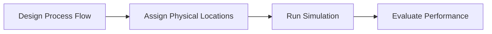

---

## Overview

**Kaizen** is a methodology for identifying and eliminating inefficiencies in industrial operations.

Practitioners - often called **Kaizen Experts** - apply it across factories and distribution hubs to optimise how materials, workers, and vehicles move through a site.

Traditionally this work is done manually with a disjointed set of general-purpose tools: process flows in one diagram, physical layouts in another, and throughput calculations in a separate spreadsheet. Keeping all three consistent is slow and error-prone.

This project involved developing a purpose-built platform for these practitioners: a web-based modeling interface backed by a Unity simulation engine. This allowed Kaizen Experts to design their process flow and physical layout in one tool, then validate the combined models in a full virtual simulation of their site.

The platform combines two modeling environments:

- **A process flow editor** describing warehouse operations
- **A 2D layout editor** representing the physical warehouse

<figure>
  
  <figcaption class="text-sm text-muted-foreground mt-2">Full wireframe overview of the modeling tool</figcaption>
</figure>

These models feed into a simulation engine that models system behaviour such as:

- Worker movement and actions
- Truck arrivals and departures
- Material flow through the warehouse

---

## Research and Problem Definition

As the system grew in complexity, early user testing and internal reviews showed that users were struggling to build warehouse simulations independently - most users needed direct support from engineers to complete a model. This became the central question: why was the tool so difficult to use without guidance?

### Research Context

My involvement began midway through the project, by which point the team's focus had shifted to improving usability.

Much of the Kaizen-specific operational context was confidential to the company, which limited independent background research. Insights were gathered primarily through regular testing sessions and reviews with domain experts.

### User and Domain Insights

Researching the target users revealed important context about how they work:

- Kaizen Experts typically model warehouse processes using general-purpose tools such as slide software or diagram tools (e.g., Lucid-style whiteboards or presentation tools). These tools provide flexibility, but each user may have a slightly different approach.
- **Material and Information Flow Charts (MIFC)** and **Value Stream Mapping (VSM)** are familiar visual languages for Kaizen practitioners - frameworks with recognisable symbols that practitioners are already comfortable with.
- While the primary users were expected to be Kaizen experts, the product was also intended for logistics hub managers and operational staff without formal Kaizen training - the tool needed to remain approachable for non-specialists.

<figure>
  

    
    
  

  <figcaption class="text-sm text-muted-foreground mt-2">These images are examples of the Value Stream Map layout and iconography - the MIFC version is similar.</figcaption>
</figure>

### Identified Problems

User testing and internal feedback surfaced three recurring patterns:

**Process logic and physical space were mentally disconnected** - Users had difficulty understanding how nodes in the process diagram corresponded to physical elements in the warehouse layout. This was particularly problematic with the use of **Link** blocks, which were originally used to act as the link between the two views.

**Real warehouse flows were too large to model quickly** - Practical models often contained dozens of nodes and connections, which exposed weaknesses in the diagram interaction design. Moving and editing multiple blocks was problematic.

**Small interaction problems created large cognitive load** - Weak selection states and unclear connection wires made it difficult for users to track what they were editing.

## Design Process and Solutions

My approach was to identify friction points in the modeling interface and propose targeted improvements that could be implemented without disrupting ongoing development. Because the product was already in active use, changes were introduced incrementally - usability issues were caught through regular internal reviews and testing sessions with domain experts, then addressed in the next development cycle.

### Validation Feedback System

Users frequently got stuck due to configuration errors in their models that were invisible until simulation - requiring engineer intervention to diagnose. To address this, I created a validation system in Unity that checked configuration files for errors and warnings. This information was automatically passed to the frontend so users could identify issues in their models.

I was given freedom to design the interface for presenting this feedback. I explored several wireframe concepts and discussed them with the UX team and frontend developers to balance usability and implementation complexity.

The final design presented validation issues in a prioritized list using collapsible sections. Ordering issues by priority helped users resolve root problems first, often eliminating several secondary issues automatically. Visual warning symbols were used sparingly, as large numbers of icons created an intimidating experience for both developers and end users.

<figure>
  
  <figcaption class="text-sm text-muted-foreground mt-2">Wireframe concepts explored for the validation feedback panel</figcaption>
</figure>

<figure>
  
  <figcaption class="text-sm text-muted-foreground mt-2">The collapsible validation panel in context within the full application view</figcaption>
</figure>

### Improving Node Readability

The mental disconnect between process logic and physical space was partly a visual problem - the diagram contained too many different element types, and their relationships weren't clear at a glance. Several changes addressed this:

In earlier versions of the process view, logical blocks and “Link” blocks were separate elements. The Link blocks represented connections to physical equipment in the warehouse layout, which added extra visual clutter and made diagrams harder to read. I proposed merging these into a single logical block, with the physical connection shown as a small tab beneath the node. This reduced the number of elements in the diagram and simplified the workflow.

<figure>
  
  <figcaption class="text-sm text-muted-foreground mt-2">Sketches exploring the merged logical block design, eliminating the separate Link block</figcaption>
</figure>

The iconography used in the process view was also inconsistent. Some nodes used standard icons while others used abstract Value Stream Mapping–style symbols, which many users found difficult to interpret. I helped standardize the interface by replacing these with clear, conventional icons, improving readability for both Kaizen experts and non-specialist users.

<figure>
  
  <figcaption class="text-sm text-muted-foreground mt-2">Evolving from abstract VSM-style symbols (Logical/Physical) to unified block representations</figcaption>
</figure>

Finally, the physical layout view previously relied on an inconsistent collection of PNG icons. These were replaced with a cohesive set of coloured isometric graphics, making physical equipment easier to recognize at a glance. This also created a stronger visual distinction between physical elements in the layout view and logical process nodes, helping users understand which parts of the model represented real-world equipment and which represented workflow logic.

<figure>
  
  <figcaption class="text-sm text-muted-foreground mt-2">Exploring block type categories inspired by VSM notation for the warehouse process nodes</figcaption>
</figure>

### Diagram Navigation and Multi-Select

Large real-world warehouse flows exposed a core scaling problem: with dozens of nodes, even simple reorganisation tasks became laborious, and the visual complexity made it hard to track what was selected or being edited. One specific issue was that selected connection wires had no visual indicator — on a large diagram with many overlapping connections, it was impossible to tell which wire was active without tracing it manually.

User testing also revealed that users wanted to reorganize large diagrams more easily. I helped introduce multi-select functionality, allowing multiple nodes to be moved simultaneously. Working with the UX team, we defined mouse and keyboard interactions that felt natural to technical users, including drag-based selection using the left mouse button. Selected wires were also given a colour highlight, making them immediately identifiable.

<figure>
  
  <figcaption class="text-sm text-muted-foreground mt-2">Left: selected wire with no visual indicator. Right: selected wire highlighted in colour</figcaption>
</figure>

<figure>
  
  <figcaption class="text-sm text-muted-foreground mt-2">Drag-based multi-select, allowing multiple nodes to be moved simultaneously</figcaption>
</figure>

This iterative approach allowed the team to refine the interface continuously while development progressed. One limitation was that feedback often came from a relatively small number of users, which introduced some risk of solutions being optimised for specific workflows rather than broader use cases.

---

## Reflection

The improvements made during the project allowed users to build warehouse layouts and process flows independently. The validation feedback tab reduced the need for direct engineer support by helping users identify configuration issues themselves. Improvements to the process view also made it easier to scale diagrams to represent realistic warehouse hubs.

One challenge that remained was the separation between the physical layout view and the process flow view. Although visual changes helped distinguish them, some users still confused the two. A likely reason was that process blocks could be positioned freely in both X and Y directions, which encouraged users to treat the process view like a physical layout. Enforcing a clearer directional flow (for example left-to-right) may have helped reinforce the conceptual difference.

This project reinforced for me that domain-specific tooling has a much higher onboarding cost than general-purpose software — users arrive with existing mental models, and any deviation from those models needs to be justified through clarity and consistency in the interface. The gains made here were real, but they pointed toward a longer design investment the product still needed.

> Diagrams and sketches shown are illustrative and not representative of the final product.
