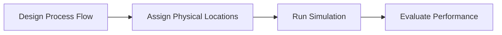

## Overview

This project focused on improving the usability of a web-based logistics simulation tool used by warehouse **Kaizen Experts** to design and evaluate material flow systems.

The platform combines two modeling environments:

- **A process flow editor** describing warehouse operations  
- **A 2D layout editor** representing the physical warehouse  

These models feed into a simulation engine that models system behaviour such as:

- Worker movement and actions
- Truck arrivals and departures
- Material flow through the warehouse

---

## Problem

As the system grew more complex, usability issues began to emerge.

Users struggled to understand relationships between the process model and the physical warehouse layout, and complex diagrams became difficult to manage.

These problems made it difficult for users to build complex warehouse simulations without guidance from engineers.

User testing and internal feedback revealed several patterns:

### Process logic and physical space were mentally disconnected

Users had difficulty understanding how nodes in the process diagram corresponded to physical elements in the warehouse layout. This was particularly problematic with the use of **Link** blocks, which were originally used to act as the link between the two views.

### Real warehouse flows were too large to model quickly

Practical models often contained dozens of nodes and connections, which exposed weaknesses in the diagram interaction design. Moving and editing multiple blocks was problematic. 

### Small interaction problems created large cognitive load

Weak selection states and unclear connection wires made it difficult for users to track what they were editing.

---

## My Role

The team’s UX improvements focused on reducing friction in the modeling workflow. 

I joined the project midway through development as a Simulation Engineer, primarily responsible for the simulation logic of the warehouse modeling system.

Because the project team was small, I also supported the frontend team by contributing UX and interaction improvements to the modeling interface. My work focused on improving usability and clarity within the process flow editor and layout tools.

My contributions included:

- Identifying usability issues in the modeling workflow
- Proposing UX improvements and interaction patterns
- Creating interface concepts and visual aids
- Collaborating with frontend developers implementing the interface in React

---

## Research and Insights

There were several challenges during this project that made gathering clear research insights difficult:

- The project leader was absent for several months during my time on the project, which limited communication between developers and stakeholders.
- Much of the Kaizen-specific operational context was confidential to the company, making independent background research difficult.
- Existing documentation was fragmented and often outdated. Many requirements were vague, incomplete, or inconsistent.

Despite these constraints, I was able to indentify **several important insights:**

- Kaizen Experts typically model warehouse processes using general-purpose tools such as slide software or diagram tools (e.g., Lucid-style whiteboards or presentation tools). These tools provide flexibility but it means each user may have a slightly different approach to using them.
- **Material and Information Flow Charts (MIFC)** and **Value Stream Mapping (VSM)** are familiar visual languages for Kaizen practitioners. These frameworks use recognizable symbols and process structures that practitioners are already comfortable with.
- While the primary users were expected to be Kaizen experts, the product was also intended for logistics hub managers and operational staff who may not have formal Kaizen training. This meant the system needed to remain approachable and usable without deep knowledge of Kaizen-specific methods.

These insights suggested that the tool must carefully balance familiar iconography and workflow for Kaizen Experts, while being accessibile enough for non-specialists.

  
  

> These images are examples of the Value Stream Map layout and iconography - the MIFC version is similar.

## Design Process and Solutions

Because the product was already in active development when I joined, design improvements were introduced incrementally alongside ongoing feature work. Rather than a dedicated prototyping phase, usability issues were identified through regular internal reviews and testing sessions with domain experts.

Within this process, I contributed by identifying friction points in the modeling interface and proposing improvements that could be implemented without disrupting development progress.

### Validation Feedback System

To support frontend development, I created a validation system in Unity that checked configuration files for errors and warnings. This information was automatically passed to the frontend so users could identify issues in their models.

I was given freedom to design the interface for presenting this feedback. I explored several wireframe concepts and discussed them with the UX team and frontend developers to balance usability and implementation complexity.

The final design presented validation issues in a prioritized list using collapsible sections. Ordering issues by priority helped users resolve root problems first, often eliminating several secondary issues automatically. Visual warning symbols were used sparingly, as large numbers of icons created an intimidating experience for both developers and end users.

### Improving Node Readability

Several changes were made to improve the clarity and consistency of nodes across the modeling interface:

In earlier versions of the process view, logical blocks and “Link” blocks were separate elements. The Link blocks represented connections to physical equipment in the warehouse layout, which added extra visual clutter and made diagrams harder to read. I proposed merging these into a single logical block, with the physical connection shown as a small tab beneath the node. This reduced the number of elements in the diagram and simplified the workflow.

The iconography used in the process view was also inconsistent. Some nodes used standard icons while others used abstract Value Stream Mapping–style symbols, which many users found difficult to interpret. I helped standardize the interface by replacing these with clear, conventional icons, improving readability for both Kaizen experts and non-specialist users.

Finally, the physical layout view previously relied on an inconsistent collection of PNG icons. These were replaced with a cohesive set of coloured isometric graphics, making physical equipment easier to recognize at a glance. This also created a stronger visual distinction between physical elements in the layout view and logical process nodes, helping users understand which parts of the model represented real-world equipment and which represented workflow logic.

### Process View Refinements

Earlier versions of the process editor contained a large number of similar-looking blocks and connections, which created visual complexity.

User testing also revealed that users wanted to reorganize large diagrams more easily. I helped introduce multi-select functionality, allowing multiple nodes to be moved simultaneously. Working with the UX team, we defined mouse and keyboard interactions that felt natural to technical users, including drag-based selection using the left mouse button.

This iterative approach allowed the team to refine the interface continuously while development progressed, addressing usability issues as they emerged. One limitation was that feedback often came from a relatively small number of users, which introduced some risk of solutions being optimized for specific workflows rather than broader use cases.usability problems as they appeared.

---

## Reflection

The improvements made during the project allowed users to build warehouse layouts and process flows independently. The validation feedback tab reduced the need for direct engineer support by helping users identify configuration issues themselves. Improvements to the process view also made it easier to scale diagrams to represent realistic warehouse hubs.

One challenge that remained was the separation between the physical layout view and the process flow view. Although visual changes helped distinguish them, some users still confused the two. A likely reason was that process blocks could be positioned freely in both X and Y directions, which encouraged users to treat the process view like a physical layout. Enforcing a clearer directional flow (for example left-to-right) may have helped reinforce the conceptual difference.

This project also highlighted to me the difficulty of designing entirely new workflows. Even with regular user testing, it was difficult to get designs right the first time. It reinforced the importance of designing interfaces that can adapt as project requirements change and user needs are better understood.

> Due to NDA constraints, detailed screenshots and metrics cannot be publicly shared. All sketches contain minor semantic differences to the real UX design. 