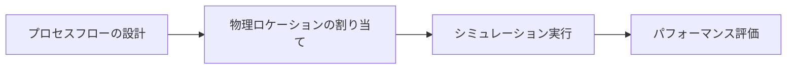

## 概要

**カイゼン**とは、産業現場における非効率を特定・排除するための手法です。

**カイゼン専門家**と呼ばれる実践者たちは、工場や物流拠点において、資材・作業員・車両の動線最適化に取り組みます。

従来、この作業は複数の汎用ツールを組み合わせて手動で行われていました。プロセスフローはダイアグラムツールで、物理レイアウトは別のツールで、スループット計算はスプレッドシートで管理するといった形です。この三つを整合性を保ちながら管理するのは時間がかかり、ミスが生じやすい作業でした。

このプロジェクトでは、こうした実践者向けに専用プラットフォームを開発しました。Unityシミュレーションエンジンを基盤とした、Webベースのモデリングインターフェースです。カイゼン専門家はプロセスフローと物理レイアウトを一つのツールで設計し、仮想シミュレーション上で統合モデルを検証できるようになりました。

このプラットフォームは二つのモデリング環境を組み合わせています：

- **プロセスフローエディタ** ― 倉庫オペレーションを記述
- **2Dレイアウトエディタ** ― 倉庫の物理空間を表現

<figure>
  
  <figcaption class="text-sm text-muted-foreground mt-2">モデリングツールの全体ワイヤーフレーム概要</figcaption>
</figure>

これらのモデルはシミュレーションエンジンに入力され、以下のようなシステムの挙動をモデル化します：

- 作業員の移動とアクション
- トラックの到着・出発
- 倉庫内の資材の流れ

---

## 調査と課題定義

システムが複雑化するにつれ、初期のユーザーテストや内部レビューを通じて、ユーザーが独力で倉庫シミュレーションを構築することに困難を感じていることが明らかになりました。多くのユーザーがモデルを完成させるためにエンジニアの直接サポートを必要としており、これが中心的な問いとなりました：なぜこのツールはガイダンスなしに使うことが難しいのか？

### 調査の背景

私がプロジェクトに参加したのは途中からであり、その時点でチームの焦点はすでにユーザビリティの改善へとシフトしていました。

カイゼン固有の業務コンテキストの多くは機密情報であったため、独立した背景調査には限界がありました。インサイトは主に、定期的なテストセッションおよびドメイン専門家とのレビューを通じて収集されました。

### ユーザーとドメインのインサイト

ターゲットユーザーの調査から、彼らの業務スタイルに関する重要なコンテキストが明らかになりました：

- カイゼン専門家は通常、プレゼンテーションソフトやダイアグラムツール（Lucid系のホワイトボードやプレゼンツールなど）を使って倉庫プロセスをモデル化します。これらのツールは柔軟性が高い一方、ユーザーによってアプローチが異なることがあります。
- **マテリアル・情報フローチャート（MIFC）**や**バリューストリームマッピング（VSM）**は、カイゼン実践者にとって馴染み深いビジュアル言語です。認識可能なシンボル体系をもつフレームワークとして、実践者はすでに使いこなしています。
- 主なユーザーはカイゼン専門家を想定していましたが、製品は正式なカイゼン研修を受けていない物流拠点マネージャーや現場スタッフにも対応できるよう、非専門家にとってもわかりやすい設計が求められていました。

<figure>
  

    
    
  

  <figcaption class="text-sm text-muted-foreground mt-2">これらの画像はバリューストリームマップのレイアウトとアイコノグラフィーの例です。MIFCバージョンも類似した構成になっています。</figcaption>
</figure>

### 特定された課題

ユーザーテストおよび内部フィードバックから、三つの繰り返し現れるパターンが浮かび上がりました：

**プロセスロジックと物理空間が頭の中で切り離されていた** ― ユーザーは、プロセスダイアグラム上のノードが倉庫レイアウト内のどの物理要素に対応しているのかを理解するのに困難を感じていました。特に問題だったのは**リンク**ブロックの使用で、元々は二つのビューをつなぐ役割を担っていましたが、混乱を招いていました。

**実際の倉庫フローは大規模すぎて素早くモデル化できなかった** ― 実用的なモデルは多くの場合、何十ものノードと接続を含んでおり、ダイアグラムのインタラクションデザインの弱点を露呈させました。複数のブロックの移動や編集が困難でした。

**些細なインタラクションの問題が大きな認知負荷を生んでいた** ― 選択状態の表現が弱く、接続ワイヤーが不明瞭だったため、ユーザーは何を編集しているのかを把握しにくい状況でした。

---

## デザインプロセスと解決策

私のアプローチは、モデリングインターフェース上の摩擦点を特定し、進行中の開発を妨げることなく実装できる的を絞った改善を提案することでした。製品がすでに稼働中だったため、変更は段階的に導入されました。ユーザビリティの問題は定期的な内部レビューおよびドメイン専門家とのテストセッションを通じて捉えられ、次の開発サイクルで対応されました。

### バリデーションフィードバックシステム

ユーザーはしばしば、シミュレーションが実行されるまで見えない設定エラーによって作業が止まり、診断のためにエンジニアの介入が必要になっていました。これに対処するため、設定ファイルのエラーや警告を検出するバリデーションシステムをUnityで構築しました。この情報は自動的にフロントエンドに渡され、ユーザー自身がモデルの問題を確認できるようになりました。

このフィードバックを提示するインターフェースの設計は私に委ねられていました。いくつかのワイヤーフレームコンセプトを検討し、UXチームおよびフロントエンド開発者と議論して、ユーザビリティと実装の複雑さのバランスを取りました。

最終的なデザインでは、折りたたみ可能なセクションを使った優先度順のリストでバリデーション問題を提示しました。問題を優先度順に並べることで、ユーザーは根本的な問題から解決でき、結果として多くの二次的な問題が自然に消えることが多くなりました。視覚的な警告シンボルは控えめに使用しました。アイコンが大量にあると、開発者・エンドユーザーの双方にとって威圧感のある体験につながるためです。

<figure>
  
  <figcaption class="text-sm text-muted-foreground mt-2">バリデーションフィードバックパネルのために検討したワイヤーフレームコンセプト</figcaption>
</figure>

<figure>
  
  <figcaption class="text-sm text-muted-foreground mt-2">アプリケーション全体のビューの中における、折りたたみ式バリデーションパネルのデザイン</figcaption>
</figure>

### ノードの可読性の向上

プロセスロジックと物理空間の精神的な断絶は、部分的には視覚的な問題でした。ダイアグラムに含まれる要素の種類が多すぎて、それらの関係性が一目でわかりにくかったのです。この問題にはいくつかの変更で対処しました：

プロセスビューの旧バージョンでは、ロジックブロックと「リンク」ブロックが別々の要素として存在していました。リンクブロックは倉庫レイアウト内の物理機器との接続を表しており、視覚的なノイズを増加させ、ダイアグラムの可読性を下げていました。これらを一つのロジックブロックに統合し、物理的な接続をノードの下部に小さなタブとして表示することを提案しました。これにより、ダイアグラム上の要素数が減り、ワークフローが簡略化されました。

<figure>
  
  <figcaption class="text-sm text-muted-foreground mt-2">別々のリンクブロックを排除した、統合ロジックブロックの設計スケッチ</figcaption>
</figure>

プロセスビューで使用されていたアイコノグラフィーも一貫していませんでした。一部のノードは標準的なアイコンを使用していましたが、他はバリューストリームマッピング風の抽象的なシンボルを使っており、多くのユーザーが解釈に困っていました。これらをわかりやすい一般的なアイコンに置き換えることで、インターフェースの標準化を支援し、カイゼン専門家と非専門家ユーザーの双方にとっての可読性を向上させました。

<figure>
  
  <figcaption class="text-sm text-muted-foreground mt-2">抽象的なVSM風シンボル（ロジック／フィジカル）から統一ブロック表現への進化</figcaption>
</figure>

最後に、物理レイアウトビューはかつて統一感のないPNGアイコンの集まりに依存していました。これらを統一感のある彩色アイソメトリックグラフィックセットに置き換え、物理機器を一目で認識しやすくしました。また、これによってレイアウトビューの物理要素とロジックノードの視覚的な区別が明確になり、モデルのどの部分が実際の機器を表し、どの部分がワークフローロジックを表しているかをユーザーが理解しやすくなりました。

<figure>
  
  <figcaption class="text-sm text-muted-foreground mt-2">倉庫プロセスノードにVSM記法を参考にしたブロックタイプカテゴリーの探索</figcaption>
</figure>

### ダイアグラムのナビゲーションとマルチセレクト

実際の大規模な倉庫フローは、スケールの核心的な問題を露呉させました。何十ものノードがある状態では、単純な整理作業でさえ簡単ではなくなり、何が選択・編集されているのか追うのが困難になりました。特に問題だったのは、選択された接続ワイヤーに視覚的なインジケーターがなかったことで―多数のワイヤーが重なり合う大きなダイアグラムでは、手動でたどることなしにどのワイイヤーがアクティブなのか判別することができませんでした。

ユーザーテストでも、大きなダイアグラムをより手軽に再整理したいというニーズが明らかになりました。複数のノードを同時に移動できるマルチセレクト機能の導入を支援しました。UXチームと協力して、技術系ユーザーにとって自然に感じられるマウスとキーボードの操作を定義しました。左マウスボタンによるドラッグ選択もその一つです。また、選択されたワイヤーには色のハイライトが付与され、即座に識別できるようになりました。

<figure>
  
  <figcaption class="text-sm text-muted-foreground mt-2">左：視覚的なガイドなしで選択されたワイヤー。右：色でハイライトされた選択ワイヤー</figcaption>
</figure>

<figure>
  
  <figcaption class="text-sm text-muted-foreground mt-2">ドラッグベースのマルチセレクトインタラクション（複数ノードを同時に移動可能）</figcaption>
</figure>

この反復的なアプローチにより、開発が進行する中でもインターフェースを継続的に改善することができました。一つの制約として、フィードバックが比較的少数のユーザーから得られることが多く、解決策が特定のワークフローに最適化されるリスクがありました。

---

## 振り返り

このプロジェクトでの改善により、ユーザーは独力で倉庫レイアウトとプロセスフローを構築できるようになりました。バリデーションフィードバックタブにより、ユーザーが設定上の問題を自分で確認できるようになったことで、エンジニアの直接サポートを必要とする場面が減りました。プロセスビューの改善により、現実の倉庫拠点を表現したスケーラブルなダイアグラムの作成も容易になりました。

残された課題の一つは、物理レイアウトビューとプロセスフロービューの分離でした。視覚的な変更によって区別しやすくはなりましたが、依然として混同するユーザーがいました。考えられる原因の一つは、プロセスブロックがX・Y方向に自由に配置できる仕様によって、ユーザーがプロセスビューを物理レイアウトのように扱ってしまうことでした。左から右への方向性のあるフローを強制することで、概念的な違いをより明確に伝えられた可能性があります。

このプロジェクトを通じて、ドメイン固有のツールは汎用ソフトウェアよりもオンボーディングコストがはるかに高いことを改めて実感しました。ユーザーはすでに既存のメンタルモデルをもって製品に向き合っており、そのモデルからの逸脱はインターフェースの明確さと一貫性によって正当化される必要があります。ここでの改善は確かに成果を上げましたが、製品がまだ必要としていた、より長期的なデザイン投資の方向性を示すものでもありました。

> 図やスケッチはあくまでイラスト的なものであり、最終製品を表すものではありません。
